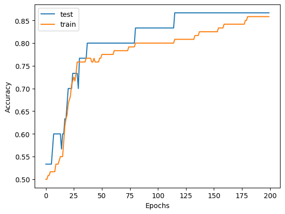

# Multi Layer Perceptron implementation in JAX

## Overview

<a href="https://francesco-bosso.github.io"></a>

*This project provides a minimal implementation of a Multi-Layer Perceptron (MLP) classifier built from scratch in JAX and trained on the Iris dataset. It demonstrates the core components of a supervised learning workflow, including model definition, forward pass, loss computation, gradient-based optimization, and accuracy evaluation, all using JAX’s functional and composable API.*

## Author
[Bosso Francesco](https://github.com/FBosso) - (fra.bosso97@gmail.com)

## Problem statement

JAX has gained popularity for its ability to combine NumPy-like syntax with powerful features such as automatic differentiation, just-in-time (JIT) compilation, and efficient execution on CPUs, GPUs, and TPUs. Unlike traditional frameworks, JAX emphasizes functional programming and enables seamless transformations like grad, jit, and vmap, making it highly suited for research and high-performance computing.

In this project, I implement a simple Multi-Layer Perceptron (MLP) classifier from scratch using JAX, trained on the Iris dataset. The goal is to explore JAX’s core capabilities in a clean, minimal example by building the full training loop manually, without relying on high-level libraries, highlighting how JAX can be used for lightweight and efficient neural network training.



## Dependencies
This project relies on the dependencies specified in the `environment.txt` file. To recreate the environment run the following command


```bash
$ pip install -r requirements.txt
```

## Usage
To run the project, make sure to install the required dependencies. Then, execute the script `jax_mlp.py`